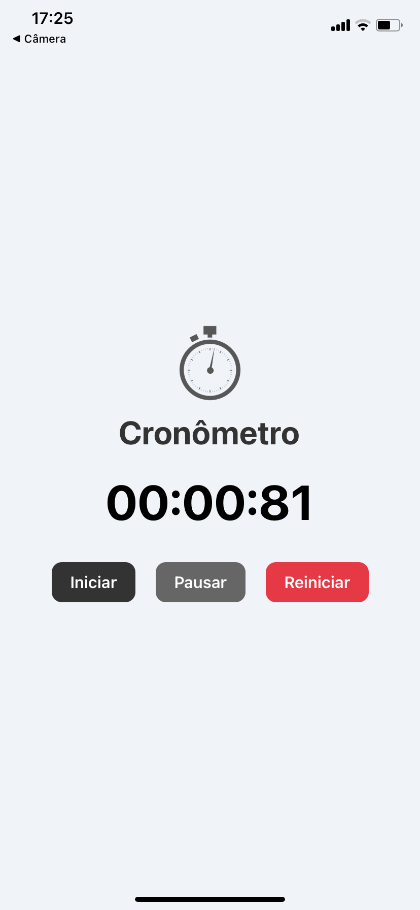

# ⏱️ Cronômetro App

Aplicativo simples de cronômetro desenvolvido em **React Native**, com as funções de iniciar, pausar e reiniciar o tempo. O tempo é exibido em **minutos, segundos e milissegundos**.

## 📱 Funcionalidades

- Iniciar cronômetro
- Pausar cronômetro
- Reiniciar tempo
- Interface moderna com paleta em preto, cinza e vermelho
- Ícone de relógio para personalização visual


## 🖼️ Tela Inicial

- Ícone de relógio no topo
- Tempo centralizado
- Três botões com ações básicas


## 🚀 Como Executar

1. Clone o repositório:

```bash
git clone https://github.com/emillyroar/cronometroApp.git
cd cronometro-app
````

2. Instale as dependências:

```bash
npm install
```

3. Execute o app:

```bash
npx expo start
```

> **Obs:** É necessário ter o [Node.js](https://nodejs.org/), [Expo CLI](https://docs.expo.dev/workflow/expo-cli/) e um emulador ou dispositivo físico com o app **Expo Go**.

## 📦 Tecnologias Utilizadas

* [React Native](https://reactnative.dev/)
* [Expo](https://expo.dev/)
* JavaScript

## 📸 App funcionando




---


